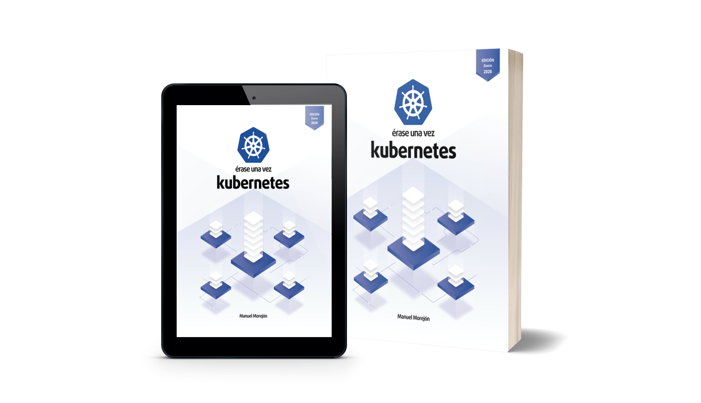

# 🏰 Érase una vez Kubernetes

<div align="center">



### El código fuente oficial para dominar Kubernetes v1.32+

**Este repositorio contiene los laboratorios prácticos del libro.**
Aquí tienes el *"qué"* (los manifiestos YAML y scripts), pero para entender el *"por qué"* (arquitectura, diseño y estrategia DevOps), necesitas la guía completa.

👇 **Consigue la edición actualizada 2025 aquí:** 👇

[](https://www.amazon.es/dp/8409212765)
[](https://leanpub.com/erase-una-vez-kubernetes)

</div>

---

## ⚡ Estado del Proyecto

> **Actualización 2025:** Este repositorio se mantiene estrictamente actualizado. Hemos migrado el entorno de laboratorio de **Vagrant** a **Kind**. Ahora puedes levantar un cluster profesional en tu portátil en menos de 2 minutos, consumiendo menos RAM y alineado con los estándares modernos.

| Rama | Distribución | Estado |
| :--- | :--- | :--- |
| **`main` / `v2.x`** | **Kind (K8s v1.32)** | ✅ **Recomendada (Libro Actual)** |
| `v1.x` | VirtualBox + Vagrant | ⚠️ Legacy (Ediciones anteriores) |

---

## 🛠️ Requisitos Previos

Para ejecutar los ejemplos sin errores, asegúrate de tener instaladas las siguientes herramientas:

* **Docker** `>= 27.2.0`
* **Kubectl** `>= 1.34.1`
* **Kind** `>= v0.30.0` (Kubernetes in Docker)

---

## 🚀 ¿Qué vas a desplegar?

Este código acompaña los capítulos del libro, donde aprenderás a:
- **Capítulo 2:** Levantar un cluster K8s multicapa en local (sin costes de nube).
- **Capítulo 9:** Estrategias de Ingress para exponer tus apps al mundo real.
- **Capítulo 12:** Gestionar almacenamiento persistente (PVCs) sin perder datos.

*¿Te has atascado en algún ejercicio? La explicación paso a paso está en el capítulo correspondiente del libro.*

---

## 🚀 Cómo empezar (Quickstart)

Sigue estos pasos para tener tu laboratorio listo tal y como se describe en el **Capítulo 2** del libro.

### 1. Clonar el repositorio
```bash
git clone [https://github.com/mmorejon/erase-una-vez-k8s.git](https://github.com/mmorejon/erase-una-vez-k8s.git)
cd erase-una-vez-k8s
```

### 2. Crear el cluster
Hemos automatizado la creación del cluster. Las configuraciones detalladas se encuentran en `cluster/kind-config.yaml`.

```bash
# Ejecuta el script de creación desde la raíz del proyecto
bash/cluster.sh create
```

### 3. Resultado esperado
Si todo ha ido bien, verás la inicialización de los nodos y el plano de control:

```text
Creating cluster "book" ...
 ✓ Ensuring node image (kindest/node:v1.32.1) 🖼
 ✓ Preparing nodes 📦 📦 📦
 ✓ Writing configuration 📜
 ✓ Starting control-plane 🕹️
 ✓ Installing CNI 🔌
 ✓ Installing StorageClass 💾
 ✓ Joining worker nodes 🚜
Set kubectl context to "kind-book"
```

¡Listo! Tu contexto de `kubectl` ahora apunta al cluster `kind-book`. Ya puedes empezar a desplegar.

```bash
kubectl cluster-info --context kind-book
```

---

## 🤝 Comunidad y Soporte

Este proyecto está vivo gracias a los lectores.

1.  🐛 **¿Error en el código?** Abre un [Issue](https://github.com/mmorejon/erase-una-vez-k8s/issues) en este repositorio.
2.  ⭐ **¿Te ha sido útil?** Dale una **estrella** al repositorio (arriba a la derecha). Nos ayuda a llegar a más ingenieros.
3.  📚 **¿Aún no tienes el libro?**

<div align="center">
    <a href="https://www.amazon.es/dp/8409212765">
        
    </a>
</div>
