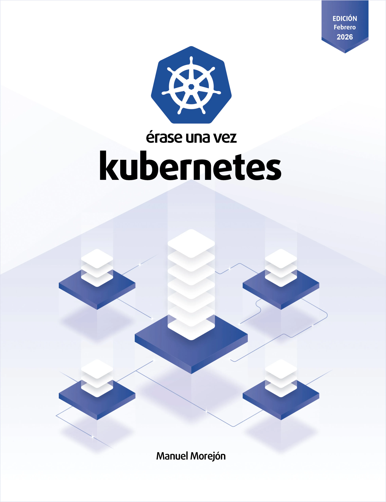

# Kubernetes: Érase una vez

<div align="center">



### El código fuente oficial para dominar Kubernetes v1.36+

**Este repositorio contiene los laboratorios prácticos del libro.**
Aquí tienes el *"qué"* (los manifiestos YAML y scripts), pero para entender el *"por qué"* (arquitectura, diseño y estrategia DevOps), necesitas la guía completa.

👇 **Consigue la edición actualizada 2026 aquí:** 👇

[](https://www.amazon.es/dp/B0GHG88VVY)
[](https://leanpub.com/erase-una-vez-kubernetes)
[](https://github.com/mmorejon/erase-una-vez-k8s/discussions)
[](https://github.com/mmorejon/erase-una-vez-k8s/discussions/categories/opiniones-y-feedback)

</div>

---

## ⚡ Estado del Proyecto

> **Actualización 2026:** Este repositorio se mantiene estrictamente actualizado. Hemos migrado el entorno de laboratorio de **Vagrant** a **Kind**. Ahora puedes levantar un cluster profesional en tu portátil en menos de 2 minutos, consumiendo menos RAM y alineado con los estándares modernos.

| Rama | Distribución | Estado |
| :--- | :--- | :--- |
| **`main` / `v2.x`** | **Kind (K8s v1.36)** | ✅ **Recomendada (Libro Actual)** |
| `v1.x` | VirtualBox + Vagrant | ⚠️ Legacy (Ediciones anteriores) |

---

## 🛠️ Requisitos Previos

Para ejecutar los ejemplos sin errores, asegúrate de tener instaladas las siguientes herramientas:

* **Docker** `>= 27.2.0`
* **Kubectl** `>= 1.36.0`
* **Kind** `>= v0.30.0` (Kubernetes in Docker)

---

## 🚀 ¿Qué vas a desplegar?

Este código acompaña los capítulos del libro, donde aprenderás a:
- **Capítulo 2:** Levantar un cluster K8s multicapa en local (sin costes de nube).
- **Capítulo 9:** Estrategias de Ingress para exponer tus apps al mundo real.
- **Capítulo 12:** Gestionar almacenamiento persistente (PVCs) sin perder datos.

*¿Te has atascado en algún ejercicio? La explicación paso a paso está en el capítulo correspondiente del libro.*

---

## 🚀 Cómo empezar (Quickstart)

Sigue estos pasos para tener tu laboratorio listo tal y como se describe en el **Capítulo 2** del libro.

### 1. Clonar el repositorio
```bash
git clone https://github.com/mmorejon/erase-una-vez-k8s.git
cd erase-una-vez-k8s
```

### 2. Crear el cluster
Hemos automatizado la creación del cluster. Las configuraciones detalladas se encuentran en `cluster/kind-config.yaml`.

```bash
# Ejecuta el script de creación desde la raíz del proyecto
bash/cluster.sh create
```

### 3. Resultado esperado
Si todo ha ido bien, verás la inicialización de los nodos y el plano de control:

```text
Creating cluster "book" ...
 ✓ Ensuring node image (kindest/node:v1.36.1) 🖼
 ✓ Preparing nodes 📦 📦 📦
 ✓ Writing configuration 📜
 ✓ Starting control-plane 🕹️
 ✓ Installing CNI 🔌
 ✓ Installing StorageClass 💾
 ✓ Joining worker nodes 🚜
Set kubectl context to "kind-book"
```

¡Listo! Tu contexto de `kubectl` ahora apunta al cluster `kind-book`. Ya puedes empezar a desplegar.

```bash
kubectl cluster-info --context kind-book
```

---

## 🤝 Comunidad y Feedback

Este proyecto está vivo gracias a los lectores. Como Leanpub no tiene un sistema de comentarios nativo, utilizamos este repositorio para centralizar la comunicación.

**¿Qué quieres hacer hoy?**

| Tu objetivo | Dónde ir |
| :--- | :--- |
| 📣 **Dejar una reseña** | [**Ir a Discussions / Opiniones y Feedback**](https://github.com/mmorejon/erase-una-vez-k8s/discussions/categories/opiniones-y-feedback) <br> *Cuéntanos qué te ha parecido el libro.* |
| 💬 **Tengo una duda** | [**Ir a Discussions / Q&A**](https://github.com/mmorejon/erase-una-vez-k8s/discussions/categories/q-a-preguntas-y-ayuda) <br> *Pregunta sobre conceptos, diagramas o ejercicios.* |
| 💡 **Sugerir ideas** | [**Ir a Discussions / Ideas**](https://github.com/mmorejon/erase-una-vez-k8s/discussions/categories/ideas-para-futuras-ediciones) <br> *Propón temas para futuros capítulos.* |
| 🐛 **Reportar errata** | [**Abrir un Issue**](https://github.com/mmorejon/erase-una-vez-k8s/issues/new) <br> *Solo para typos o errores en el código.* |

---

1.  ⭐ **¿Te ha sido útil?** Dale una **estrella** al repositorio (arriba a la derecha). Nos ayuda a llegar a más ingenieros.
2.  📚 **¿Aún no tienes el libro?** Compra el libro en Amazon o Leanpub.

<div align="center">
    <a href="https://www.amazon.es/dp/B0GHG88VVY">
        
    </a>
</div>
